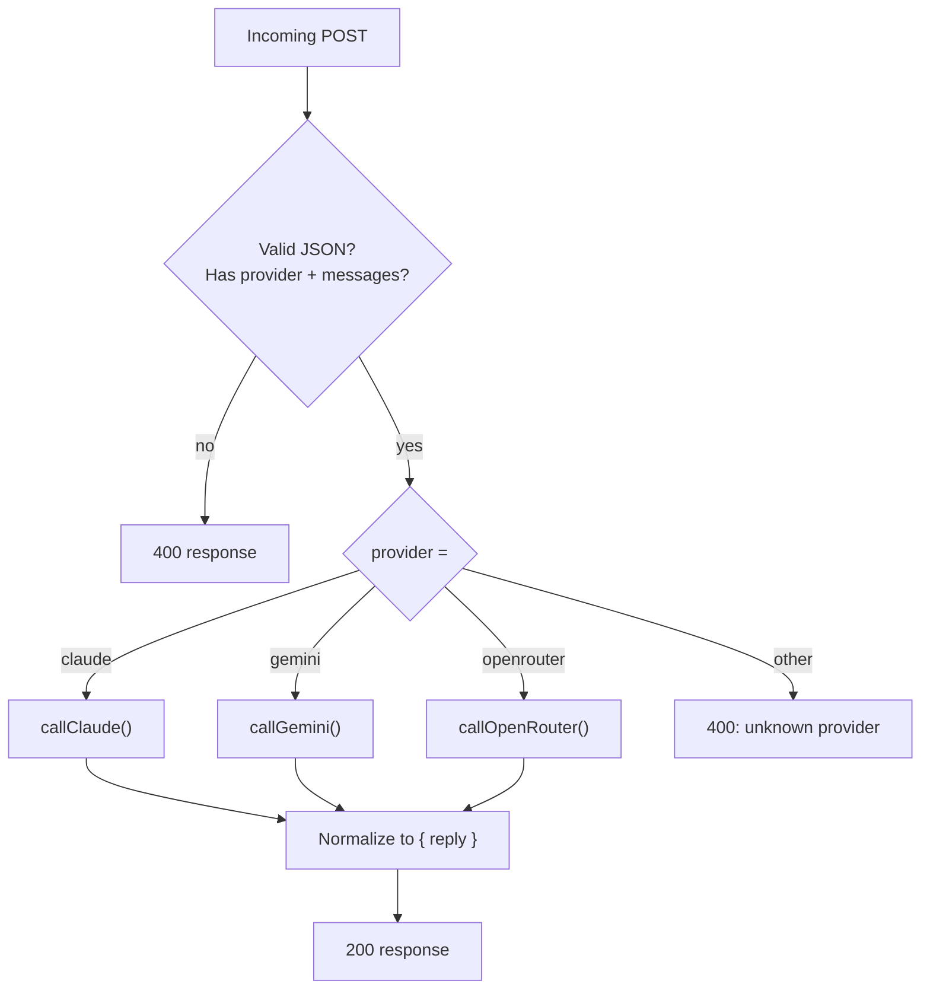

# Architecture

This document goes one level deeper than the README for anyone extending Prism or reviewing it as a portfolio piece.

## Design goals

1. **No build step.** Every variant is a single static HTML file. Anyone can open it, read it top to bottom, and understand the whole system — no bundler, no framework, no `node_modules`.
2. **Keys never touch the browser (cloud mode).** The frontend only ever talks to a proxy it trusts; provider credentials live exclusively as Worker secrets.
3. **A genuine zero-infrastructure option (local mode).** No server, no key, no account — the tradeoff is explicit and visible in the UI (smaller model, WebGPU requirement) rather than hidden behind a "no key needed" claim that oversells what's possible.
4. **One visual language, two backends.** The UI layer doesn't know or care which backend it's talking to; both implement the same message-list/compose/stream contract.

## Component breakdown

### `index.html` / `prism-pro.html` (cloud mode)

- Renders the chat shell, sidebar, and composer.
- On send, POSTs the full message history to whatever URL is saved in Settings (`state.workerUrl`).
- Expects a JSON response shaped `{ reply: string }`.
- Has no knowledge of API keys, rate limits, or provider-specific request formats — that's entirely `worker.js`'s job.

### `worker.js` (cloud mode backend)

- A single Cloudflare Worker `fetch` handler.
- Reads `provider`, `model`, and `messages` from the request body.
- Branches to one of three functions (`callClaude`, `callGemini`, `callOpenRouter`), each of which:
  - builds the provider-specific request shape,
  - attaches the correct auth header using a Worker secret,
  - normalizes the response back to a single `reply` string.
- CORS is wide open (`*`) by default; restrict it via `ALLOWED_ORIGIN` once you know your frontend's final domain (see `docs/DEPLOYMENT.md`).

### `index-local.html` / `prism-pro-local.html` (local mode)

- Same chat shell, different engine underneath.
- The WebLLM library is imported **dynamically**, inside `loadModel()`, not as a static top-level `import`. This is a deliberate choice: a static import failing would take down the entire script — including unrelated UI like the login screen — since a module's top-level statements must all succeed before any of its code runs. Deferring the import means a blocked CDN only affects the model-loading feature, nothing else.
- Tries three CDN sources in sequence (`esm.run`, `jsdelivr`, `unpkg`) before giving up, since ESM CDN availability varies by network/region/ad-blocker.
- Once loaded, `state.engine.chat.completions.create({ messages, stream: true })` returns an async-iterable stream of token deltas; if streaming throws before any tokens arrive, it retries once as a non-streaming call before surfacing an error.

### Shared UI conventions (all four variants)

- **Conversation model**: `{ id, title, messages: [{ role, content, provider|tier, latencyMs }] }`, held in memory only — no `localStorage`, so the files stay dependency-free and behave identically whether previewed or deployed.
- **Message actions**: copy (always available) and regenerate (assistant messages only) re-run the same send/stream path against a message-history slice, not special-cased logic.
- **Export**: conversation → Markdown via `Blob` + a synthetic anchor click, no server round-trip.

## Why a proxy instead of client-side keys (cloud mode)

Putting a provider API key directly in frontend JavaScript means anyone who opens dev tools has your key. The Worker proxy pattern used here is the standard fix: the browser authenticates to *your* Worker (optionally, with real user auth — see Roadmap), and the Worker is the only thing that ever sees the real provider credentials.

## Why WebGPU instead of a tiny cloud free-tier (local mode)

An always-available "free" cloud endpoint either costs someone money per request or rate-limits hard enough to be unreliable for a demo. WebGPU inference has a real cost too — it's paid once, up front, as a multi-hundred-MB-to-multi-GB download — but after that it's genuinely free and infinite, with no server to keep alive or pay for. That tradeoff (download cost now vs. per-request cost forever) is why local mode exists as a distinct variant rather than a hidden fallback.
